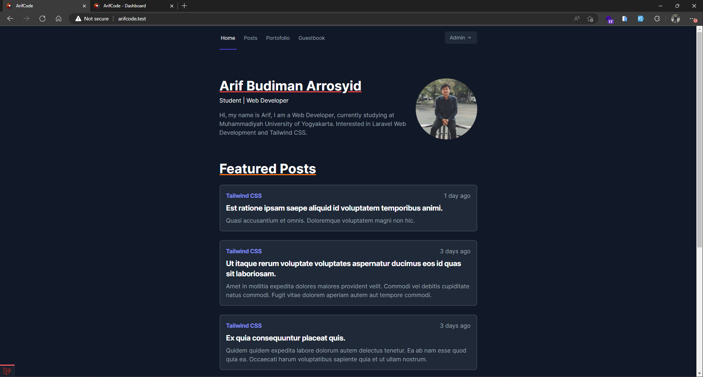
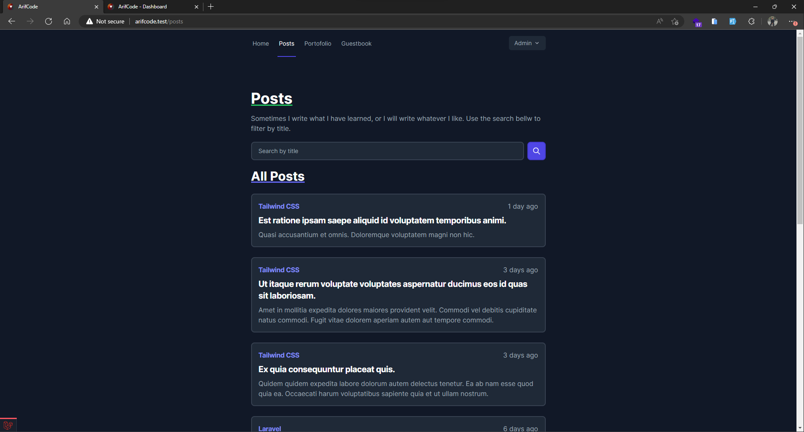
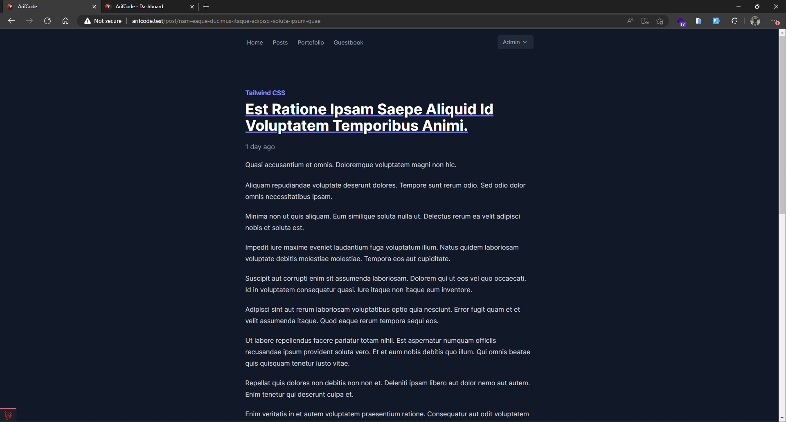
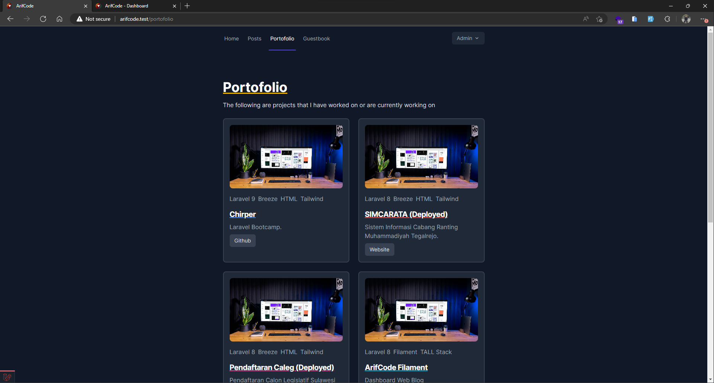
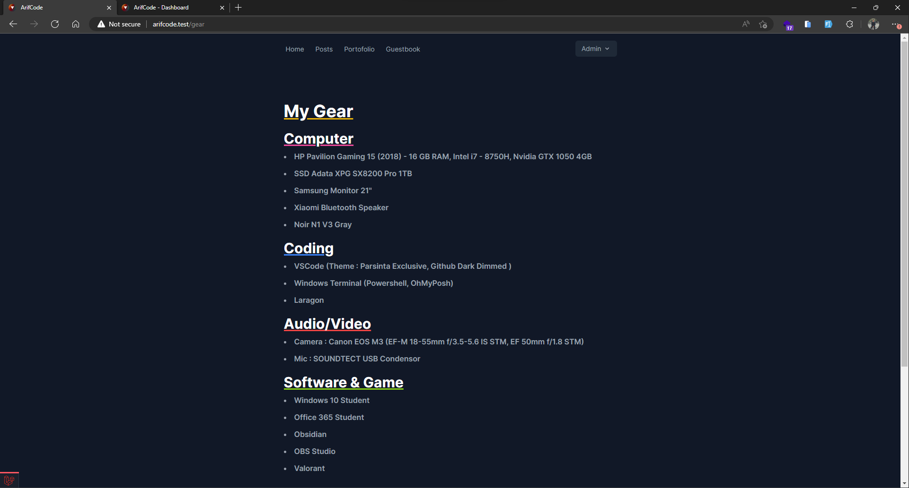
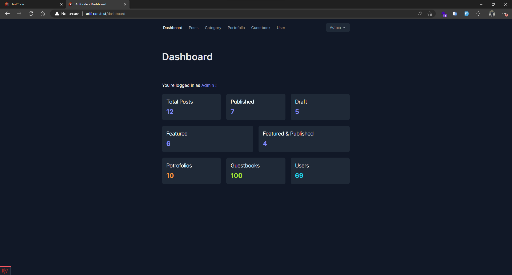
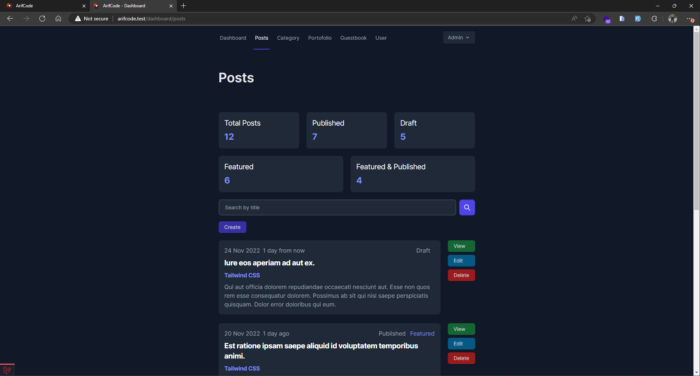

# Laravel
Developed with Laravel 9, Laravel Breeze, Tailwind CSS, Flowbite.

## System Requirement
- Laravel 9 Support
- PHP >=8.0

## Install
```
git clone https://github.com/arifbudimanarrosyid/arifcode.git
```
```
composer install
```
```
npm install
```
```
make `.env` file & configure
```
```
php artisan key:generate
```
```
npm run dev
```
```
php artisan migrate:fresh --seed
```

go to https://github.com/settings/developers and make OAuth Apps with Auth callback url http://localhost:8000/auth/callback/github

add to '.env'
```
GITHUB_CLIENT_ID = 
GITHUB_CLIENT_SECRET = 
```

change 'services.php'
```
'github' => [
        'client_id' => env('GITHUB_CLIENT_ID'),
        'client_secret' => env('GITHUB_CLIENT_SECRET'),
        'redirect' => 'http://localhost:8000/auth/callback/github',
    ],
```

## Login & Register
Register form default account type is_admin false
### Admin
>email: admin@admin.com

>password: password

### User
>email: user@user.com

>password: password


## Site Screenshot







## Dashboard Screenshot



## Feature
- [x] Light Mode & Dark Mode (Auto)
- [x] Home - Featured Posts
- [x] Posts - All Posts
- [x] Single Post - Recomendation Posts
- [x] Portofolio
- [x] Guestbook
  - [x] Create 
  - [x] Read 
  - [x] Update
  - [x] Delete 
  - [x] Pin (Admin)
  - [x] Unpin (Admin)
- [x] About Me
- [x] Gear


## Middleware & Gate

### Auth
- [x] Auth - Login & Register
- [x] Guestbook
  - [x] Create
  - [x] Read
  - [x] Update
  - [x] Delete
- [x] Dashboard
- [x] Profile

### Admin
- [x] Dashboard - Posts
  - [x] Create
  - [x] Read
  - [x] Update
  - [x] Delete & Update Thumbnail
  - [x] Delete
  - [ ] Delete All Draft Posts (disable if draft posts = 0)
- [x] Dashboard - Category
  - [x] Create
  - [x] Read
  - [x] Update
  - [ ] Delete (disable)
- [x] Dashboard - Users
  - [x] Change role to Admin
  - [x] Change role to User
