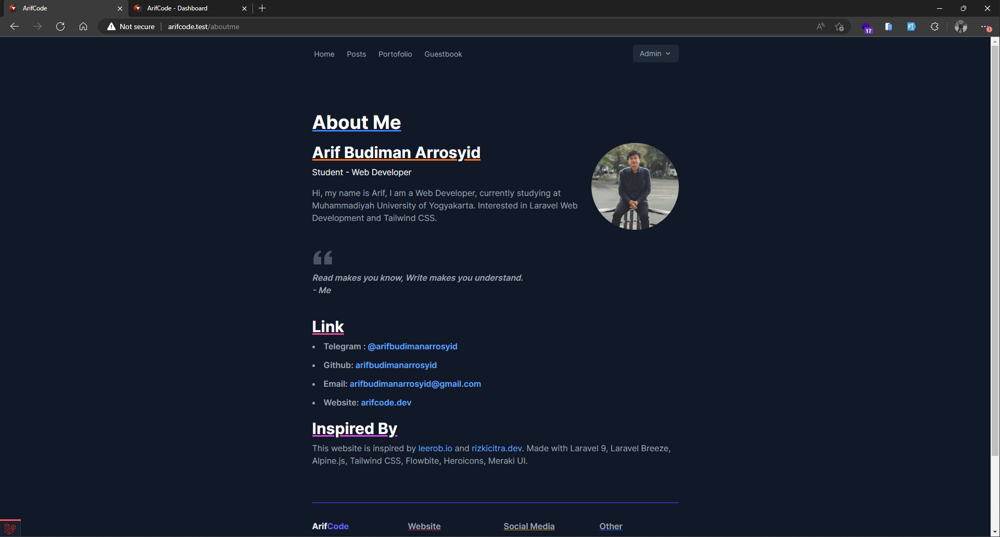

# Laravel
Developed with Laravel 9, Laravel Breeze, Tailwind CSS, Flowbite.

## System Requirement
- Laravel 9 Support
- PHP >=8.0

## Install
```
git clone https://github.com/arifbudimanarrosyid/arifcode.git
```
```
npm install
```
make `.env` file & configure
```
php artisan key:generate
```
```
npm run dev
```
```
php artisan migrate:fresh --seed
```

## Login & Register
Register form default account type is_admin false
### Admin
>email: admin@admin.com

>password: password

### User
>email: user@user.com

>password: password


## Site Screenshot




## Dashboard Screenshot


## Feature
- [x] Light Mode & Dark Mode (Auto)
- [x] Home - Featured Posts
- [x] Posts - All Posts
- [x] Single Post - Recomendation Posts
- [x] Portofolio
- [ ] Guestbook
- [x] About Me
- [x] Gear


## Middleware & Gate

### Auth
- [x] Auth - Login & Register
- [ ] Guestbook
  - [ ] Create
  - [ ] Read
  - [ ] Update
  - [ ] Delete
- [x] Dashboard
- [x] Dashboard - Profile

### Admin
- [ ] Dashboard - Posts
  - [ ] Create
  - [x] Read
  - [ ] Update
  - [ ] Delete
- [ ] Dashboard - Category
  - [ ] Create
  - [x] Read
  - [ ] Update
  - [ ] Delete
- [ ] Dashboard - Portofolio
  - [ ] Create
  - [ ] Read
  - [ ] Update
  - [ ] Delete
- [ ] Dashboard - Guestbook
  - [ ] Create
  - [ ] Read
  - [ ] Update
  - [ ] Delete
- [ ] Dashboard - Users
  - [ ] Create
  - [x] Read
  - [ ] Update
  - [ ] Delete
